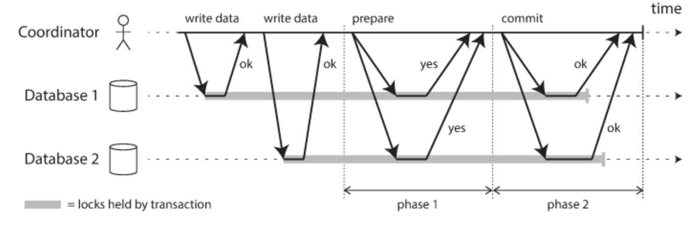
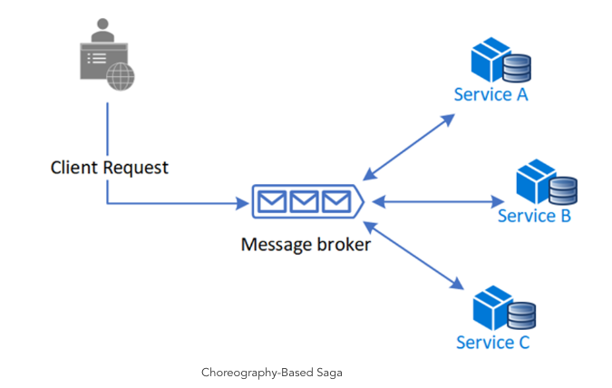
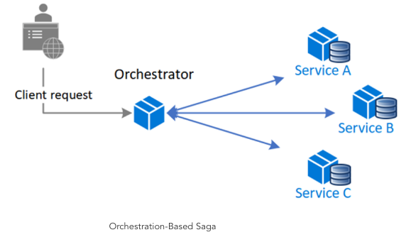

## 개요
필자는 주로 모놀리식 구조 애플리케이션을 개발하였고, 단일 데이터베이스 환경에서만 주로 개발을 했었습니다. 요즘 업무를 하면서 MSA 환경 및 다중 데이터베이스를 이용한 환경들을 고민을 해야되는 경우가 발생하여, 이러한 환경에서의 트랜잭션 처리에 대해서 공부를 하게 되었습니다. 이번 글에서는 MSA 환경에서의 트랜잭션 처리 방법에 대해서 정리를 하고자 합니다.
모놀리식 아키텍처에서는 하나의 데이터베이스에서 트랜잭션을 시작하고, 커밋을 하거나 롤백을 하면 되지만, MSA 환경에서는 여러 개의 데이터베이스를 사용하기 때문에 각각 데이터베이스의 ACID 트랜잭션을 보장하기는 어렵습니다.
 
* 보통 한 개의 데이터베이스의 하나의 트랜잭션을 로컬 트랜잭션이라고 하며, 여러 개의 데이터베이스 또는 데이터베이스와 메시지 큐 등의 두 개 이상의 자원을 트랜잭션 처리 하기 위해서는 글로벌 트랜잭션을 사용해야 합니다.
- ACID
  - Atomicity : 모든 작업이 성공하거나 모두 실패한다. 트랜잭션은 부분적으로 실행되다가 중단되지 않도록 보장한다.
  - Consistency : 트랜잭션 실행 후 성공적으로 완료하면 일관성 있는 데이터베이스 상태를 유지한다. 데이터의 상태가 트랜잭션 전후의 모든 제약 조건을 준수한다.
  - Isolation : 동시 트랜잭션이 발생하여도 서로 방해하거나 영향을 미치지 않는다.
  - Durability : 트랜잭션이 성공적으로 완료되면 변경 결과는 저장되도록 보장한다.

## XA와 2PC
### XA(eXtended Architecture) 란
  - 동일한 전역 트랜잭션 내에서 몇 개의 리소스에 접근하기 위한 X/Open 제정한 표준
  - XA 표준 규격은 하나의 트랜잭션 매니저가 어떤 트랜잭션의 한 부분으로 어떤 작업이 수행되고 있는지를 데이터베이스에 통보하는 방식과, 각 트랜잭션이 완료 될 때 2PC(2 Phase Commit) 을 수행하는 방식 권장
  - 하나의 표준이기 때문에, 모든 호환되는 리소스 혹은 드라이버들이 분산 트랜잭션의 일부로서 트랜잭션 매니저와 연동, 2PC 고려되어야 하는 상황이라면 XA는 트랜잭션 매니저와 리소스를 연결해주는 역할

### 2PC 란
  - 2 Phase Commit의 약자로, 분산 환경에서의 트랜잭션 처리를 위한 프로토콜
  - 원자적 커밋 프로토콜(Atomic Commit Protocol) 의 일종으로, 트랜잭션을 커밋할지 롤백할지에 대한 분산 원자적 트랜잭션(Distributed Atomic Transaction) 에 관여하는 분산 알고리즘 중 하나


  - 위 그림처럼 서로 다른 리소스에 대한 요청을 원자적으로 처리하기 위해 1. Prepare Phase, 2. Commit Phase 두 단계로 나누어 처리하여 서로 다른 DB 간 정합성을 보장
  - 각각 서로 다른 리소스에 데이터를 추가/변경 등의 작업을 한 뒤 phase1 에서 모든 리소스에 반영할 수 있을지 물어보고 합의가 되지 않았을 경우 롤백을 하고, 합의가 되었을 경우 phase2 에서 커밋을 한다.
  - 하지만 그림을 통해서 알 수 있듯이 데이터를 추가/변경 등의 작업을 시작할 때부터 커밋될 때까지 Lock 이 걸림, 이로인해서 양 쪽 리소스를 함께 조회하더라도 커밋되지 않은 쪽은 락이 잡혀 때문에 두 리소스가 불일치된 상태로 조회되지 않는다. 락을 이용해서 정합성 보장
  - 하지만 이러한 2PC 방식은 성능 이슈(Lock)가 있음

### 2PC 단점
  - 2PC는 각각 DB에 트랜잭션 시작할 때 부터 Lock 잡고 있기 때문에 사용자가 많을 경우에 여러 요청들이 들어올 경우 Lock 으로 인해서 요청에 대한 처리가 늦어지고, 해당 요청들을 처리 하지 못해서 자원을 할당 받지 못하는 경우가 발생할 수 있음(DeadLock)
  - Transaction Coordinator 에 의존하여 모든 서비스에 대한 준비 상태 확인 등 해당 Coordinator 에 대한 의존성 및 해당 Coordinator 가 다운되면 전체 서비스가 다운될 수 있음
  - NoSQL 에서는 제공이 안되며, 2PC를 지원하지 않는 데이터베이스가 있음

### JTA(Java Transaction API) 란
============== JTA 진행 중 ==============
  - 플랫폼마다 상이한 트랜잭션 매니저들과 어플리케이션들이 상호작용할 수 있는 인터페이스를 정의, 트랜잭션 처리가 필요한 어플리케이션이 특정 벤더의 트랜잭션 매니저에 의존할 필요 없음
  - JTA 는 JTS(Java Transaction Service) 와 JTA(Java Transaction API) 로 구성, JTS 는 트랜잭션 관리자를 제공하고, JTA 는 트랜잭션 관리자와 트랜잭션을 처리하는 애플리케이션 간의 통신을 위한 API 를 제공한다.
  - Spring Boot 엣는 Atomikos, Bitronix JTA 구현체를 지원

### Atomikos 를 이용하여 트랜잭션 처리 구현
  1. Atomikos 라이브러리 추가 (Spring Boot 3 기준)
```groovy
    implementation 'com.atomikos:transactions-spring-boot-starter:6.0.0'
    implementation 'jakarta.transaction:jakarta.transaction-api:2.0.1'
```
============== JTA 진행 중 ==============

## Saga 패턴
Saga 패턴이란 마이크로서비스들끼리 이벤트를 주고 받아 특정 마이크로서비스에서의 작업을 실패하면 이전까지의 작업이 완료된 마이크로서비스에게 보상 이벤트를 소싱함으로서 분산 환경에서 원자성을 보장하는 패턴

* 보상 트랜잭션 : 글로벌 트랜잭션을 여러 개의 로컬 트랜잭션으로 분리하여 각 로컬 트랜잭션은 독립적으로 실행하며, 모든 로컬 트랜잭션이 성공적으로 완료되면 글로벌 트랜잭션을 커밋하고, 실패 시, 그 서비스의 앞선 다른 서버스들에서 처리된 상태를 이전 상태로 되돌리게 하는 트랜잭션

### Saga 패턴 구조
### Choreography Based
  - 각 로컬트랜잭션이 다른 서비스의 로컬 트랜잭션을 이벤트 트리거 하는 방식, 중앙 집중형이 아닌, 이벤트를 교환하며 모든 서비스가 메시지 브로커를 통해 이벤트를 주고 받는 방식 
  - 로컬 트랜잭션을 처리하고, 다음 서비스에게 이벤트 전달(성공, 실패에 대한 부분을 큐에 전달)


#### 장점 
  - 참가자가 거의 없고 조정 논리가 필요하지 않은 간단한 워크플로에 적합
  - 각 서비스가 자체적으로 이벤트를 발행하고 처리 하므로 별도의 중계자가 필요 없기 때문에 시스템 복잡성 감소
  - 서비스가 독립적으로 동작하기 떄문에, 새로운 서비스를 추가하거나 기존 서비스를 확장하기 쉽다
  - 서비스 간의 직접적인 의존성이 없기 때문에 서비스 간의 결합도가 갑소

#### 단점
  - 서비스가 독립적으로 이벤트를 처리하므로, 이벤트에 대한 순서를 관리하는 것이 어려울 수 있음, 이로 인해 데이터 일관성을 유지 하는 것이 복잡 할 수 있다.
  - 각 서비스가 자체적으로 바성 트랜잭션을 관리 해야 하므로 보상 로직의 복잡성 증가
  - 각 서비스가 독립적으로 동작하므로, 전체 시스템에서 오류를 추적하고 디버깅 하는 것이 어려울 수 있음
  - 서로의 명령을 소비해야 하기 때문에 Saga 참가자 간에 순환 종속성 발생 위험

### Orchestration Based
  - 중앙 중계자(Orchestrator)가 각 마이크로 서비스의 로컬 트랜잭션을 관리하는 방식, 중앙 중계자는 각 마이크로 서비스의 로컬 트랜잭션을 관리 하는 방식으로, 모든 로컬 트랜잭션의 실행 순서와 결과를 관리 하며, 보상 트랜잭션 실행도 합니다
  - 트랜잭션에 관여하는 모든 서비스는 중계자(Orchestrator)에 의해서 점진적으로 트랜잭션을 수행하며 결과를 중계자에게 전달, 그렇게 마지막 트랜잭션이 정상적으로 끝나게 되면 중계자는 종료하면서 전체 트랜잭션 종료, 실패 시 해당 보생 트랜잭션 발행


#### 장점
  - 시간이 지남에 따라 많은 참가자가 관여하거나 새 참가자가 추가되는 복잡한 워크플로에 적합
  - 중계자(Orchestrator)는 일반적으로 Saga 참가자에게 의존하지 않기 때문에 순환 종속성이 도입하지 않는다
  - 중계자가 이벤트의 순서를 관리하므로 데이터 일관성 유지하는게 더 간단합니다
  - 중계자가 모든 로컬 트랜잭션을 관리하기 때문에 전체 시스템에서 오류를 추적하고 디버깅하는 것이 더 쉽다

#### 단점
  - 추가 디자인 복잡성을 위해서 조정 논리를 구현해야 함
  - 중계자(Orchestrator)가 전체 워크 플로를 관리하기 때문에 추가 실패 지점이 생긴다.

* 순환 종속성(Circular Dependency) : 두 개 이상의 모듈이 서로를 참조하거나 의존하는 상황, 코드의 구조를 복잡하게 만들고, 유지보수를 어렵게 하는 구조 예를 들어, 모듈 A가 모듈 B에 의존하고, 동시에 모듈 B가 모듈 A에 의존하는 경우 순환 종속성이 발생합니다. 이런 상황에서는 모듈 A와 B가 서로를 참조하므로, 하나의 모듈을 독립적으로 변경하거나 테스트하는 것이 어렵게 됩니다.

### Orchestration Based(Camel + LRA)를 이용한 MicroService 간 보상 거래 구현 (Spring Boot 3 기준)
### 1. Docker 이용한 LRA Coordinator 설치
```shell script
docker run -i -p 8088:8080 quay.io/jbosstm/lra-coordinator
```

### 2. build.gradle 에 Camel 의존성 추가
Gradle 의존성 추가를 하였으며, Tomcat 을 사용하지 않고, Undertow를 사용하도록 설정을 변경하였습니다.
```groovy
implementation ('org.springframework.boot:spring-boot-starter-web') {
    //톰캣 제거
    exclude module: 'spring-boot-starter-tomcat'
}
compileOnly 'org.apache.camel.springboot:camel-spring-boot-dependencies:4.5.0'
implementation 'org.apache.camel:camel-netty-http:4.5.0'
implementation 'org.apache.camel.springboot:camel-spring-boot-starter:4.5.0'
implementation 'org.apache.camel.springboot:camel-undertow-starter:4.5.0'
implementation 'org.apache.camel.springboot:camel-lra-starter:4.5.0'
implementation 'org.apache.camel:camel-http-common:4.5.0'
implementation 'org.apache.camel.springboot:camel-http-starter:4.5.0'
implementation 'org.apache.camel.springboot:camel-servlet-starter:4.5.0'
```

### 3. Camel LRA 설정
```yml
camel:
  servlet:
    mapping:
      enabled: true
      context-path: /*
  lra:
    enabled: true
    coordinator-url: http://localhost:8088
    local-participant-url: http://host.docker.internal:8080
    local-participant-context-path: /lra-participant
```

### 4. Router 설정
RouteBuilder 상속을 받아서, configure 메서드를 오버라이딩하여 라우터를 설정

### 별첨) 개발을 진행하면서 특이 사항
#### 1. Docker 네트워크 이슈
compensation 을 이용해서 실패 시, 보상 처리를 테스트를 진행을 해보고 었습니다. 그런데 보상 거래가 정상적으로 실행이 안되고, Docker 를 이용하여 실행 한 LRA Coordinator 에서 아래 로그가 계속 찍히는 현상이 발생 하였습니다.
```
2024-05-05 15:54:32,146 INFO  [io.nar.lra] (Periodic Recovery) LRAParticipantRecord.doEnd(compensate) HTTP PUT at http://localhost:8001/lra-participant/compensate?id=SAGA+Simple+Test&Camel-Saga-Compensate=direct://cancelPayment failed for LRA http://localhost:8088/lra-coordinator/0_ffffac110002_8f7d_66379dff_12 (reason: jakarta.ws.rs.ProcessingException: io.netty.channel.AbstractChannel$AnnotatedConnectException: Connection refused: localhost/127.0.0.1:8001)
```
해당 부분은 Docker 네트워크에 대한 이해가 필요합니다. Docker 컨테이너는 기본적으로 격리된 환경을 제공하며 이 때문에 컨테이너는 자체적인 로컬 호스트를 가지고, 호스트 메신의 로컬 호스트와 다릅니다. 따라서 컨테이너 내부에서 localhost 또는 127.0.0.1를 사용하여 호스트 머신에 접근을 하려고 하면 안됩니다.
```
변경 전 : camel.lra.local-participant-url=http://localhost:8001
변경 후 : camel.lra.local-participant-url=http://host.docker.internal:8001
```
그래서 현재는 간단하게 Saga 패턴을 구현을 해서 테스트를 하기 위한 목적이기 때문에 위와 같이 설정을 변경하여 테스트를 진행을 하였습니다.
Docker 18.03 버전 이후부터는 host.docker.internal 이라는 호스트명을 사용하여 호스트 머신에 접근을 할 수 있습니다. Docker가 자동으로 호스트 머신의 IP주소로 해석을 해줍니다.